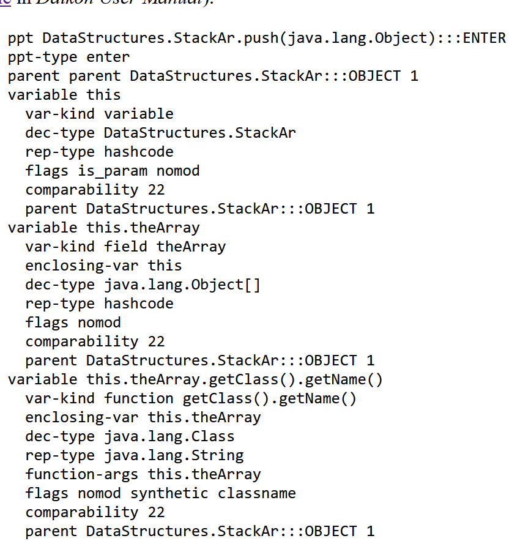

# ProgramAnalysisProject
Course project for Group 8 in 02242 Program Analysis at DTU

## Instrumenter

### Declare variables
[From](https://plse.cs.washington.edu/daikon/download/doc/developer/File-formats.html#Variable-declarations)

    var-kind <kind> [<relative-name>]

    Specifies the variable kind. Possible values are: field, function, array, variable, return. 
    If field or function are specified, the relative name of the field or function must be specified. For example, if the variable is this.theArray, the relative name is theArray. 
    Pointers to arrays are of type field. The arrays themselves (a sequence of values) are of type array. A var-kind entry is required in each variable block. 

     dec-type <language-declaration>

    This is what the programmer used in the declaration of the variable. 
    Names for standard types should use Java’s names (e.g., int, boolean, java.lang.String, etc.), but names for user-defined or language-specific types can be arbitrary strings. 
    A dec-type entry is required in each variable block.
    
    rep-type <daikon-type>
    The representation type should be one of boolean, int, hashcode, double, or java.lang.String; or an array of one of those (indicated by a [..] suffix). 
    
    shouldn't be a problem for us, is only when rep-type!=dec-type

    flag <flags>
    
    is_param -> parameters of a function
    no_dups -> array without duplicates (set)
    not_ordered -> for arrays
    nomod -> constant variable

    comparability <int>
    in the example all variables with comparability 22 are comparable between each other (eg are all int)
    so i guess we can make a list of types and all the same type have their index as comparability value

    parent <relation-type> <parent-ppt-name> <relation-id>

    Specifies the program point hierarchy 
    this looks hard maybe we just put the class name and hope for the best
    
[Dataflow hierarchy](https://plse.cs.washington.edu/daikon/download/doc/developer/Daikon-internals.html#Dataflow-hierarchy). 