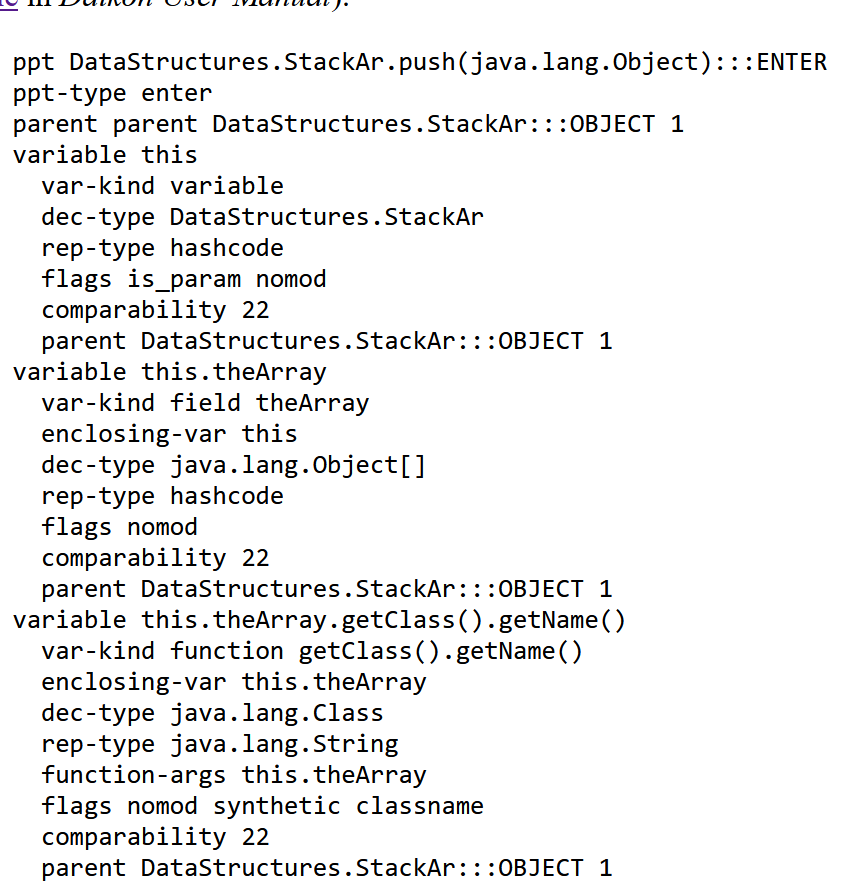
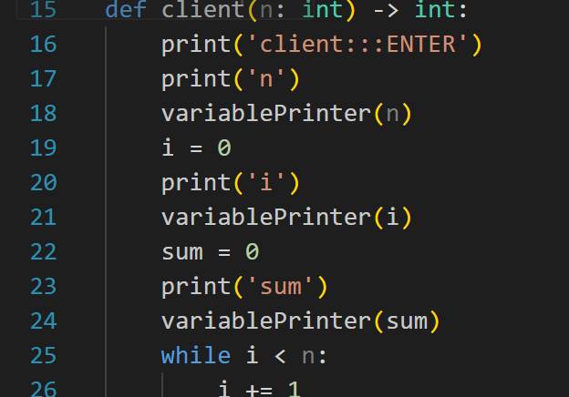
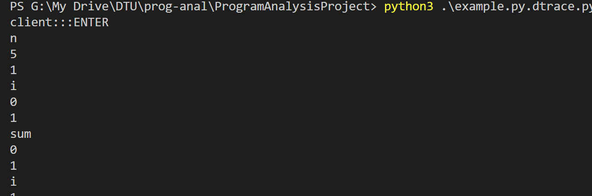
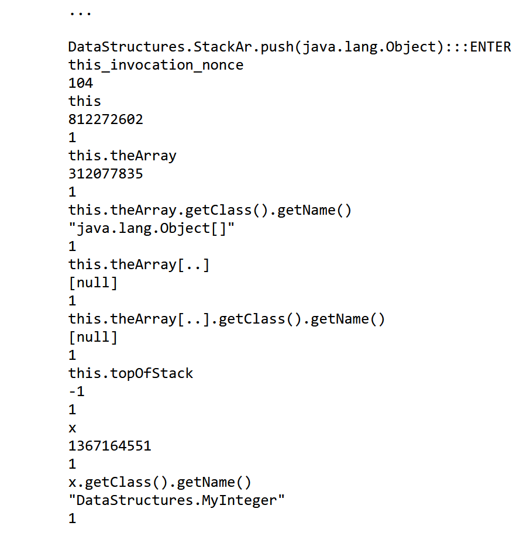

# Instrumenter

## How to use it 

### instrumenter.py
    
    python instrumenter.py filename.py

This will generate filename.py.dtrace.py, this is the instrumented code.

The program does not add any call to the main function of the input file, this may be handled by Pynguin.

    python filename.py.dtrace.py > filename.dtrace

This will create the dtrace that has to be analysed by Daikon, if you are on windows the file may be encoded in UTF-16, re-encode it in UTF-8.

### Run Daikon

Download Daikon [here](https://plse.cs.washington.edu/daikon/download/).

Run it by:

    java -cp  daikon.jar daikon.Daikon filename_1.dtrace filename_2.dtrace

## Daikon documentation for further development

### Declare variables
[From](https://plse.cs.washington.edu/daikon/download/doc/developer/File-formats.html#Variable-declarations)

    var-kind <kind> [<relative-name>]

    Specifies the variable kind. Possible values are: field, function, array, variable, return. 
    If field or function are specified, the relative name of the field or function must be specified. For example, if the variable is this.theArray, the relative name is theArray. 
    Pointers to arrays are of type field. The arrays themselves (a sequence of values) are of type array. A var-kind entry is required in each variable block. 

     dec-type <language-declaration>

    This is what the programmer used in the declaration of the variable. 
    Names for standard types should use Java’s names (e.g., int, boolean, java.lang.String, etc.), but names for user-defined or language-specific types can be arbitrary strings. 
    A dec-type entry is required in each variable block.
    
    rep-type <daikon-type>
    The representation type should be one of boolean, int, hashcode, double, or java.lang.String; or an array of one of those (indicated by a [..] suffix). 
    
    shouldn't be a problem for us, is only when rep-type!=dec-type

    flag <flags>
    
    is_param -> parameters of a function
    no_dups -> array without duplicates (set)
    not_ordered -> for arrays
    nomod -> constant variable

    comparability <int>
    in the example all variables with comparability 22 are comparable between each other (eg are all int)
    so i guess we can make a list of types and all the same type have their index as comparability value

    parent <relation-type> <parent-ppt-name> <relation-id>

    Specifies the program point hierarchy 
    this looks hard maybe we just put the class name and hope for the best
    
[Dataflow hierarchy](https://plse.cs.washington.edu/daikon/download/doc/developer/Daikon-internals.html#Dataflow-hierarchy). 

## Data trace records
### Data trace tutorial:

    python3 datatracer.py <file-with-function.py>

This creates a file with the instrumenter instruction, the function has to be called (there's no function call by default cause it should be called by Pynguin) and the output redirected to Daikon.

[from](https://plse.cs.washington.edu/daikon/download/doc/developer/File-formats.html#Data-trace-records)

### Data trace requirements for Daikon

A data trace record (also known as a sample) contains run-time value information. Its format is:

    <program-point-name>
    this_invocation_nonce
    <nonce-string>
    <varname-1>
    <var-value-1>
    <var-modified-1>
    <varname2>
    <var-value-2>
    <var-modified-2>

In other words, the sample record contains:

    name of the program point
    optionally, an arbitrary string (a nonce) used to match up procedure entries (whose names conventionally end with :::ENTER) with procedure exits (whose names conventionally end with :::EXIT). This is necessary in concurrent systems because there may be several invocations of a procedure active at once and they do not necessarily follow a stack discipline, being exited in the reverse order of entry. For non-concurrent systems, this nonce is not necessary, and both the line this_invocation_nonce and the nonce value may be omitted.
    for each variable:
        name
        value
            if an integer: sequence of digits, optionally preceded by a minus sign. Boolean values are written as the number 0 (for false) or the number 1 (for true). For pointers, the value may be null.
            if a string: characters surrounded by double-quotes. Internal double-quotes and backslashes are escaped by a backslash. Newlines and carriage returns are represented as ‘\n’ and ‘\r’, respectively.
            if an array: open bracket ([), elements separated by spaces, close bracket (]). (Also, the array name should end in ‘[..]’; use ‘a[..]’ for array contents, but ‘a’ for the identity of the array itself.) 

        The value representation may also be the string nonsensical; see Nonsensical values. A string or array value is never null. A reference to a string or array may be null, in which case the string or array value is printed as nonsensical.
        modified? (0, 1, or 2). This value is 0 if the variable has not been assigned to since the last time this program point was executed, and 1 if the variable has been assigned to since then. It is safe for an implementation to always set it to 1. It is also safe to always set it to 0, because Daikon corrects obviously incorrect modification bits (such as 0 for a never-before-seen value).

        The special value 2 should be used only (and always) when the value field is nonsensical.

    The variables should appear in the same order as they did in the declaration of the program point, without omissions or additions. 
